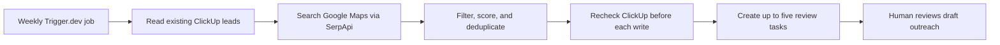

# Lead Research Automation

**A scheduled TypeScript workflow that turns Google Maps business research into a deduplicated ClickUp review queue.**

Built for Amanecer AI to make recurring lead research repeatable. It combines
external APIs, persistent duplicate checks, a weekly quota, and draft outreach
that a person reviews before contacting a business.

## Start here

- [Scheduled workflow](src/trigger/amanecer-leads/weekly-leads.ts): API calls, candidate ranking, weekly quota, and task creation.
- [Core logic](src/trigger/amanecer-leads/lead.ts): matching keys, scoring, outreach templates, and Mountain Time week boundaries.
- [Unit tests](src/trigger/amanecer-leads/lead.test.ts): changed Maps IDs, separate business locations, persisted keys, and time-zone boundaries.



## What it does

This Trigger.dev task runs Mondays at 8:00 a.m. Mountain time. It uses three
SerpApi Google Maps searches, checks every task in the **Amanecer AI Leads**
ClickUp List (including closed and archived tasks), and creates up to five new
lead tasks with a fit score, sources, discovery questions, and a draft outreach
message for human review.

It does not send outreach or make claims that a business has missed calls.
Missed-call volume and CRM access are discovery questions.

## Engineering choices

- **Persistent duplicate detection:** stable Maps IDs, phone numbers, and website/location combinations survive recurring runs.
- **One active run:** a queue concurrency limit reduces collisions between runs; the task rechecks the destination before each write.
- **Bounded work:** three searches and a five-lead weekly quota limit research volume. The week boundary uses America/Denver.
- **Human review:** scoring and outreach are deterministic rules and templates. This workflow does not call an LLM or send outreach.
- **Explicit limits:** cross-system writes are not transactional, so duplicate prevention is best effort. Website signals are qualification hints, not proof of a business's needs.

## Verify locally without external API calls

Use Node.js 22, matching the GitHub Actions environment.

```bash
npm ci
npm run check
npm test
```

The unit tests use synthetic fixtures and do not create ClickUp tasks.

## Configure a working copy

Copy `.env.example` to `.env` and provide `SERPAPI_API_KEY`, `CLICKUP_API_TOKEN`,
and `CLICKUP_LIST_ID` for your own accounts. Before using the Trigger.dev CLI,
replace the project reference in `trigger.config.ts` with your own Trigger.dev
project reference. The current configuration contains the original project's
non-secret identifier; `TRIGGER_PROJECT_REF` in the example environment file
does not override that configuration.

Triggering the scheduled task makes external API calls and can create real
ClickUp tasks. Use a dedicated test List for a first run.

### Original workspace setup

- `RylekSecondBrain/.env`: `SERPAPI_API_KEY`, `CLICKUP_API_TOKEN`, and
  `TRIGGER_AMANECER_LEADS_DEV_SECRET_KEY`.
- This folder's `.env`: `TRIGGER_PROJECT_REF` and `CLICKUP_LIST_ID`.

The task loads the shared SecondBrain file during local development. For
Trigger.dev cloud runs, add `SERPAPI_API_KEY`, `CLICKUP_API_TOKEN`, and
`CLICKUP_LIST_ID` to the target project's environment variables. The cloud
worker cannot read a local OneDrive file.

## Develop and deploy

1. `npm install`
2. `npm run check && npm test`
3. `npm run dev` and complete the browser login requested by the Trigger.dev CLI.
4. Test a development run in the Trigger.dev dashboard. This creates real
   ClickUp lead tasks, so inspect the List afterward.
5. Add the three cloud environment variables to production, then deploy with
   `npm run deploy` after reviewing the first development run.

The GitHub repository runs type checks and tests on every pull request
and every push to `main`. A second GitHub Actions workflow deploys Trigger.dev
production automatically after every push to `main`. Its Trigger.dev personal
access token is stored as the encrypted `TRIGGER_ACCESS_TOKEN` GitHub secret.

## Duplicate handling

Each ClickUp task stores `LEAD_KEYS_JSON` with its Google Maps place ID, data ID,
phone, and website/location combinations. Every run scans the whole List before
searching and again before each create. The task queue permits one run at a
time. If a business has no stable Maps ID, public phone, or website, it is
skipped. Keep existing lead tasks in this List, including closed ones, so their
keys remain available for future checks.
